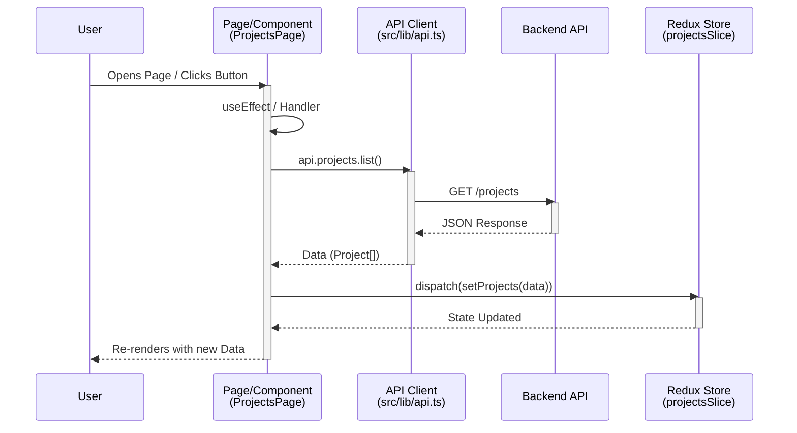

# Frontend Architecture & Data Flow

This document provides a detailed overview of the frontend architecture for the SwapSim application. It covers the technology stack, data flow patterns, and a comprehensive guide to the file structure.

## 1. Technology Stack

-   **Framework**: React 19 (via Vite)
-   **Language**: TypeScript
-   **State Management**: Redux Toolkit
-   **Routing**: React Router v7
-   **Styling**: Tailwind CSS v4, Shadcn UI (Radix UI)
-   **Maps**: React Leaflet
-   **HTTP Client**: Custom `ApiClient` wrapper around native `fetch`

## 2. Data Flow Architecture

The data flow in this application follows a **unidirectional** pattern typical of modern React/Redux applications, but with API calls handled at the component level (thunk-less approach).

### Core Flow Pattern
1.  **User Interaction/Page Load**: A user lands on a page (e.g., `ProjectsPage`) or performs an action (e.g., "Create Project").
2.  **Component Logic**: The component (often a Page or a smart container) triggers an asynchronous function.
3.  **API Client**: The component calls methods from `src/lib/api.ts` (e.g., `api.projects.list()`).
4.  **Backend Request**: The `ApiClient` adds the Auth token, sends the HTTP request to the backend, and handles basic errors.
5.  **State Update**:
    -   On success: The component dispatches a Redux action (e.g., `setProjects(data)`) to update the global store.
    -   On error: The component triggers a UI notification (Toast) and optionally updates "error" state in Redux.
6.  **Re-render**: components subscribe to the Redux store (`useAppSelector`) and re-render with the new data.

### Data Flow Diagram

## 3. File & Directory Guide

Below is a detailed explanation of the purpose and use case for every key file and directory in the `frontend` folder.

### Root Directory

| File/Folder | Use Case |
| :--- | :--- |
| `package.json` | Defines project dependencies, scripts (dev, build), and metadata. |
| `vite.config.ts` | Configuration for the Vite build tool (plugins, aliases). |
| `tsconfig.json` | TypeScript compiler configuration. |
| `.env` | Environment variables (e.g., `VITE_API_BASE_URL`). |
| `index.html` | The entry HTML file. Contains the root `div` where React attaches. |
| `public/` | Static assets that are served as-is (icons, manifest). |

### Source Directory (`src/`)

#### Entry Points & Setup
| File | Use Case |
| :--- | :--- |
| `main.tsx` | The application entry point. Renders `<App />` into `index.html`. |
| `App.tsx` | Main application component. Sets up **Routes**, **Redux Provider**, and **Global Toaster**. |
| `index.css` | Global styles and Tailwind CSS directives. |

#### `src/store/` (State Management)
| File | Use Case |
| :--- | :--- |
| `index.ts` | Configures the Redux store. Exports typed hooks (`useAppDispatch`, `useAppSelector`). |

#### `src/features/` (Redux Slices)
| File | Use Case |
| :--- | :--- |
| `authSlice.ts` | Manages user authentication state (user info, token). |
| `projectsSlice.ts` | Manages the list of projects and the currently selected project. |
| `stationsSlice.ts` | Manages the battery swapping stations data. |
| `scenariosSlice.ts` | Manages simulation scenarios and their configurations. |
| `uiSlice.ts` | Manages UI-only state (sidebar, active tab, etc.). |

#### `src/lib/` (Utilities)
| File | Use Case |
| :--- | :--- |
| `api.ts` | **Crucial File**. Contains the `ApiClient` class that handles all communication with the backend. Centralizes auth headers and error handling. |
| `utils.ts` | Helper functions (e.g., class name merging with `cn`). |

#### `src/pages/` (Route Views)
| File | Use Case |
| :--- | :--- |
| `LandingPage.tsx` | Public home page. |
| `AuthPage.tsx` | Login and Signup forms. |
| `ProjectsPage.tsx` | Dashboard for listing and creating projects. Fetches project lists via API. |
| `SimulationPage.tsx` | The main workspace. Manages the complex state of the map, sidebars, and simulation playback for a specific project. |

#### `src/components/` (UI Components)
| Folder/File | Use Case |
| :--- | :--- |
| `ui/` | Contains reusable Shadcn UI primitives (Button, Card, Dialog, etc.). |
| `simulation/` | **Domain-Specific Components**: |
| ↳ `SimulationMap.tsx` | Renders the Leaflet map, stations, and vehicles. |
| ↳ `LeftSidebar.tsx` | Controls for simulation inputs (Baseline/Scenario config). |
| ↳ `RightSidebar.tsx` | Displays Output/KPIs (Process results, charts). |
| ↳ `TimelinePlayback.tsx` | Controls for playing back the simulation results over time. |
| ↳ `*Modal.tsx` | specific dialogs for adding/editing stations. |

#### `src/hooks/`
| File | Use Case |
| :--- | :--- |
| `useAuth.ts` | Custom hook to simplify accessing auth state and login/logout functions. |

## How to Create a Frontend Like This

To replicate this architecture:
1.  **Scaffold**: Use `npm create vite@latest` with React/TypeScript.
2.  **Style**: Install Tailwind CSS and verify configuration.
3.  **UI Library**: Initialize `shadcn-ui` to get high-quality accessible components.
4.  **State**: Set up Redux Toolkit (`configureStore`) and create slices for your data domains.
5.  **API Layer**: Create a robust `api.ts` wrapper (like the one in `src/lib/`) to handle tokens and types centrally. Do not make `fetch` calls directly in components without this wrapper.
6.  **Routing**: define routes in `App.tsx` and wrap private routes with a `ProtectedRoute` component that checks auth state.
7.  **Components**: Build "dumb" UI components in `components/ui` and "business" features in `pages` or feature specific folders.
